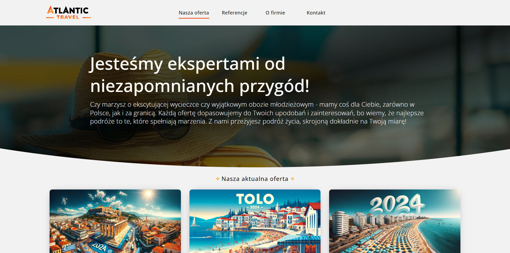
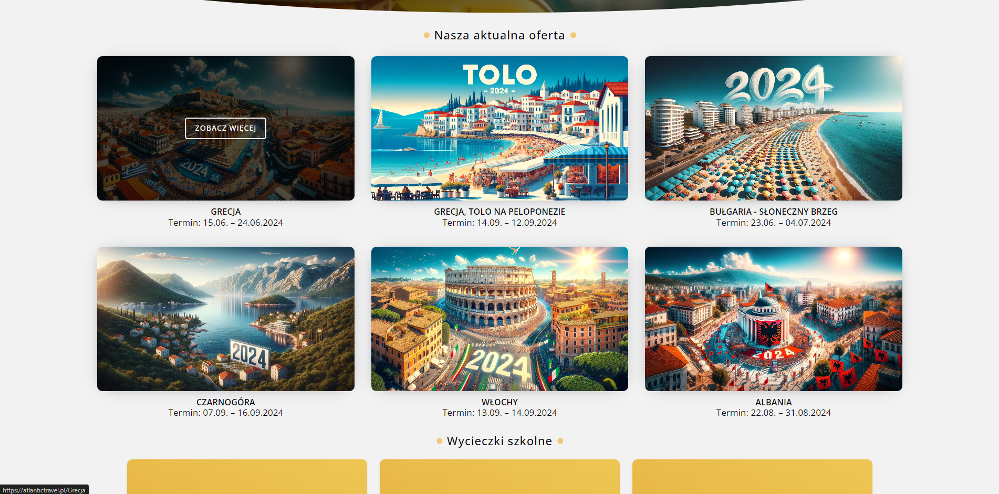
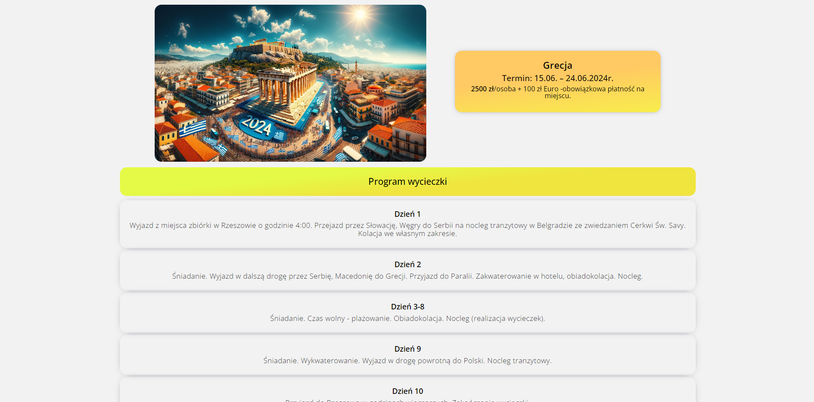
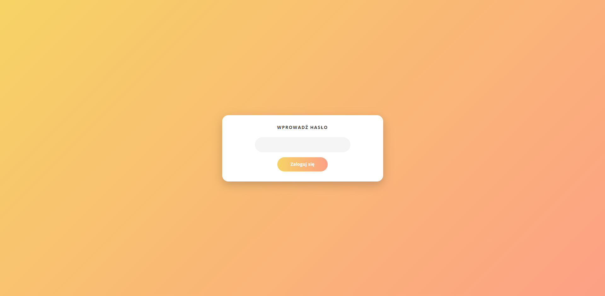
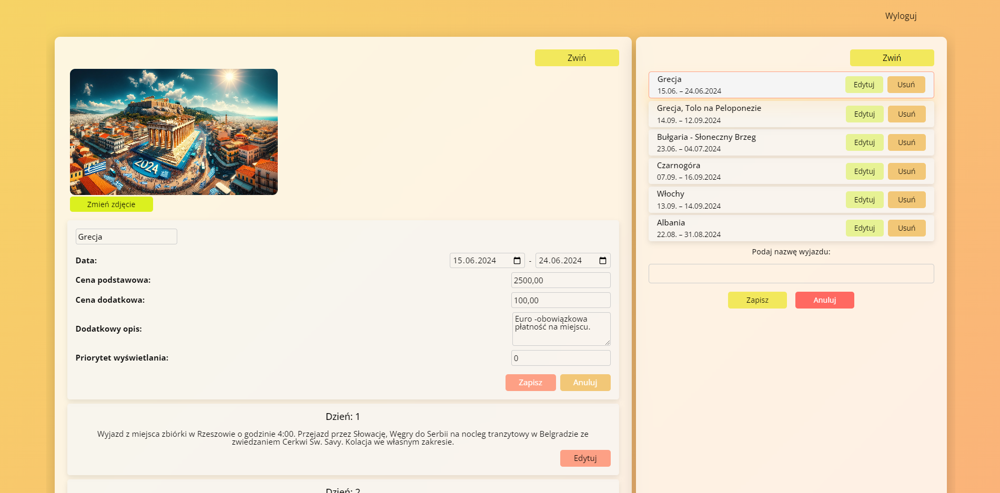
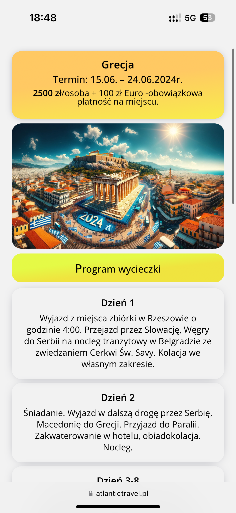
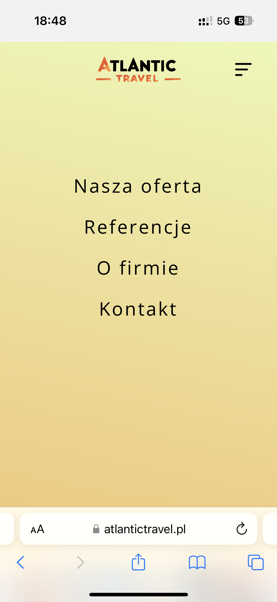
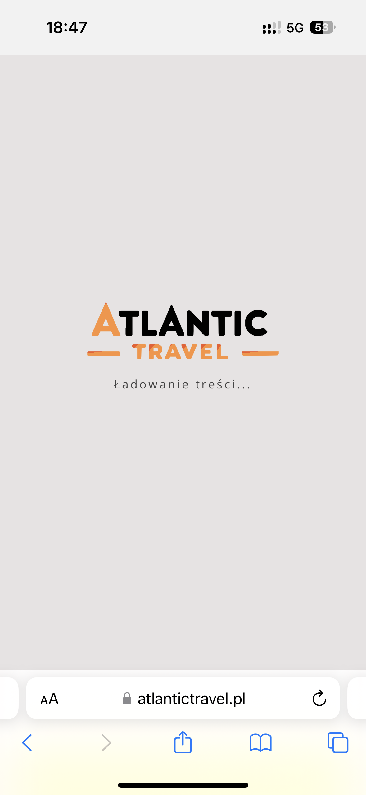

# Web Application for Travel Agency Management System

## Brief Description

This is a full-stack web application developed from scratch using React for the client side and Express with MySQL for the server side. The application showcases the company's current travel offers, school trips, company information, and testimonials. It includes a custom-built management panel and a scalable database structure designed to facilitate future expansion of the admin panel with additional editing features. Data is dynamically loaded from the database, and the application supports photo and file uploads, which are securely stored on the server. The client application is hosted on a separate server, while the database and server are hosted on AWS. The application is optimized for mobile devices to ensure a seamless user experience across all platforms.

## Technologies

- **Node.js**
- **Express.js**
- **MySQL**
- **Sequelize**
- **React**
- **React Router v6**
- **SCSS Modules**
- **Axios**
- **date-fns**
- **TanStack Query**
- **RESTful API**
- **bcryptjs**
- **multer**
- **reflect-metadata**

## Features

- **Secure Administrator Login**: Implements protected routes requiring authentication to access the admin panel.
- **Custom Management Panel**: Allows administrators to add or remove trips from the current offerings, set display priorities, and manage trip details.
- **Trip Management**: Provides functionalities to add new trips, set prices, upload photos, write descriptions, and specify additional costs and details.
- **Dynamic Content Editing**: Enables dynamic addition and editing of trip days, optional excursions, included excursions, and services directly from the admin panel.
- **Company Information Editing**: Facilitates modification of contact information, payment details, email addresses, and other company-related data.
- **File Management**: Supports uploading and managing photos and downloadable files, which are stored securely on the server.
- **Responsive Design**: Optimized for various devices to ensure a seamless user experience across desktops, tablets, and mobile phones.
- **Data-Driven Content**: All site content is dynamically loaded from the database, ensuring real-time updates.
- **Scalable Architecture**: Designed with a scalable database and application structure to allow future expansion of the admin panel and additional features.

## Environment Variables

The application requires the following environment variables:

- **DB_HOST**: Hostname or IP address of the database server.
- **DB_USER**: Username for accessing the database.
- **DB_PASSWORD**: Password for the database user account.
- **DB_DATABASE**: Name of the database to connect to.
- **JWT_SECRET**: Secret key used for JWT authentication; should be a unique and secure string.
- **ADMIN_PASSWORD**: Password for administrative access; should be kept confidential and known only to authorized personnel.

## Database Schema

The `atlantictravel_database` includes the following tables:

1. **companyinfo**

   - `company_id`: Primary key.
   - `name`: Company name.
   - `address`: Company address.
   - `postal_code`: Postal code.
   - `city`: City.
   - `NIP`: Tax Identification Number.
   - `REGON`: National Business Registry Number.
   - `phone1`: Primary phone number.
   - `phone2`: Secondary phone number.
   - `phone3`: Tertiary phone number.
   - `email1`: Primary email address.
   - `email2`: Secondary email address.
   - `bank_account_number`: Domestic bank account number.
   - `bank_account_description`: Description of the domestic bank account.
   - `foreign_bank_account_number`: Foreign bank account number.
   - `foreign_bank_account_description`: Description of the foreign bank account.
   - `SWIFT_code`: SWIFT code for international transfers.
   - `headquarters_address`: Headquarters address.
   - `headquarters_postal_code`: Headquarters postal code.
   - `headquarters_city`: Headquarters city.

2. **downloadablefiles**

   - `file_id`: Primary key.
   - `title`: Title of the downloadable file.
   - `file_path`: File path or URL to the downloadable file.

3. **includedexcursions**

   - `excursion_id`: Primary key.
   - `trip_id`: Foreign key referencing `trips` table.
   - `description`: Description of the included excursion.

4. **optionalexcursions**

   - `optional_excursion_id`: Primary key.
   - `trip_id`: Foreign key referencing `trips` table.
   - `description`: Description of the optional excursion.

5. **schooltrips**

   - `school_trip_id`: Primary key.
   - `name`: Name of the school trip.
   - `description`: Description of the school trip.
   - `trip_duration`: Duration of the trip in days.
   - `services`: Services included in the school trip.

6. **services**

   - `service_id`: Primary key.
   - `trip_id`: Foreign key referencing `trips` table.
   - `description`: Description of the service.

7. **testimonials**

   - `testimonial_id`: Primary key.
   - `title`: Title of the testimonial.
   - `description`: Content of the testimonial.
   - `file_url`: URL to an associated file.

8. **tripcontacts**

   - `contact_id`: Primary key.
   - `trip_id`: Foreign key referencing `trips` table.
   - `phone1`: Primary phone number.
   - `phone2`: Secondary phone number.
   - `phone3`: Tertiary phone number.
   - `email1`: Primary email address.
   - `email2`: Secondary email address.
   - `payment_instructions`: Instructions for payment.
   - `additional_description`: Additional notes.
   - `payment_reference`: Payment reference.

9. **tripdays**

   - `day_id`: Primary key.
   - `trip_id`: Foreign key referencing `trips` table.
   - `day_number`: Day identifier.
   - `description`: Activities for the day.

10. **tripimages**

    - `image_id`: Primary key.
    - `trip_id`: Foreign key referencing `trips` table.
    - `image_url`: URL to the image.
    - `description`: Description of the image.

11. **trips**

    - `trip_id`: Primary key.
    - `title`: Title of the trip.
    - `start_date`: Start date.
    - `end_date`: End date.
    - `price_per_person`: Price per person.
    - `additional_costs`: Additional costs.
    - `description`: Description of the trip.
    - `priority`: Display priority.

## API Endpoints

### Authentication Routes (`authRouter.js`)

- **POST /auth/login**

  - **Description**: Authenticates a user and returns a JWT token.
  - **Controller**: `login`

### Dashboard Routes (`dashboardRouter.ts`)

- **GET /dashboard**

  - **Description**: Checks token validity and retrieves dashboard data.
  - **Controller**: `checkToken`

- **PATCH /dashboard/updateMainInfo**

  - **Description**: Updates the main information of a trip.
  - **Controller**: `patchMainInfo`

- **PATCH /dashboard/updateDay**

  - **Description**: Updates information for a specific day of a trip.
  - **Controller**: `patchDay`

- **POST /dashboard/createDay**

  - **Description**: Creates a new day entry for a trip.
  - **Controller**: `createDay`

- **POST /dashboard/modifyIncludedExcursionsTrip**

  - **Description**: Modifies the included excursions for a trip.
  - **Controller**: `modifyIncludedExcursionsTrip`

- **POST /dashboard/modifyServicesTrip**

  - **Description**: Modifies the services associated with a trip.
  - **Controller**: `modifyServicesTrip`

- **POST /dashboard/modifyOptionalExcursionsTrip**

  - **Description**: Modifies the optional excursions for a trip.
  - **Controller**: `modifyOptionalExcursionsTrip`

- **POST /dashboard/modifyContactTrip**

  - **Description**: Updates the contact information for a trip.
  - **Controller**: `modifyContactTrip`

- **POST /dashboard/updatePhotoTrip**

  - **Description**: Updates the photo associated with a trip.
  - **Controller**: `updatePhotoTripController`
  - **Middleware**: `upload.single("photo")` (handles file uploads)

- **DELETE /dashboard/deleteTrip**

  - **Description**: Deletes a trip.
  - **Controller**: `deleteTripController`

- **POST /dashboard/addTrip**

  - **Description**: Adds a new trip.
  - **Controller**: `addTripController`

### School Trips Routes (`schoolTripsRouter.js`)

- **GET /school/:schoolTrips**

  - **Description**: Retrieves details for a specific school trip.
  - **Controller**: `getSchoolTrips`

### Testimonials Routes (`testimonialsRouter.js`)

- **GET /testimonials**

  - **Description**: Retrieves all testimonials.
  - **Controller**: `getAllTestimonials`

### Trips Routes (`tripsRouter.js`)

- **GET /trips**

  - **Description**: Retrieves a list of all trips.
  - **Controller**: `getAllTrips`

- **GET /trips/:tripId**

  - **Description**: Retrieves details for a specific trip.
  - **Controller**: `getTripDetails`

## Application Screenshots

### Desktop Interface

#### Home Page



#### Current Offers Section



#### Trip Details Page



#### Loading Screen


#### Admin Login Page



#### Admin Dashboard



### Mobile Interface

<table>
  <tr>
    <td>
      
      <br>
      Home Page
    </td>
    <td>
      
      <br>  
      Current Offers Section
    </td>
  </tr>
  <tr>
    <td>
      
      <br>
      Trip Details Page  
    </td>
    <td>
       
      <br>
      Navigation Menu
    </td>
  </tr>
  <tr>
    <td colspan="2" style="text-align:center;">
      
      <br>
      Loading Screen
    </td>
  </tr>  
</table>

## Pre-installation Requirements

The application requires a Node.js environment to run locally. Follow the steps below to set up and run the project:

### 1. Clone the Project Repository:

- Clone the repository to your local machine.

### 2. Client Setup:

- Navigate to the `client` directory.
- Run `npm install` to install client-side dependencies.
- Configure the API base URL in `src/api/client.ts`:
  ```javascript
  const BASE_URL = "http://localhost:3000";
  ```
  Modify this value if you plan to deploy the application to a production server.
- To start the frontend application in development mode, execute `npm run dev` in the terminal.

### 3. Server Setup:

- Navigate to the `server` directory.
- Run `npm install` to install server-side dependencies.
- To start the backend application in development mode, execute `npm run dev` in another terminal window.

### 4. Database Setup:

- Ensure that the MySQL database is set up as described in the `database` directory files.
- The database can be created using tools like MySQL Workbench.

### Note:

- Both the client and the server must be running concurrently in separate terminal windows for the application to function properly.
